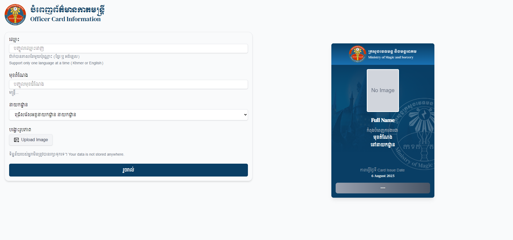

# MMS Officer Card Maker

A modern Vue 3 + Nuxt 3 web application for generating professional officer ID cards — with support for Khmer language, image uploads, department-based color gradients, and more.

This project does not store any user data.


##  Preview




## Tech Stack

- **[Nuxt 3](https://nuxt.com/)** – Vue 3 meta-framework
- **[Vue 3](https://vuejs.org/)** – Reactive frontend framework
- **[Tailwind CSS](https://tailwindcss.com/)** – Utility-first CSS
- **[GSAP](https://gsap.com/)** – Advanced animation library


##  Setup

Clone the repository and install dependencies:

```bash
# npm
npm install

# yarn
yarn install

# pnpm
pnpm install

# bun
bun install
```

## Development

Run the local dev server:

```bash
# npm
npm run dev

# yarn
yarn dev

# pnpm
pnpm dev

# bun
bun run dev
```
Then visit: http://localhost:3000

#### Install Required Libraries
### TailwindCSS
---
```bash
npm install -D @nuxtjs/tailwindcss
```

In nuxt.config.ts:
```
export default defineNuxtConfig({
  modules: ['@nuxtjs/tailwindcss']
})
```
#### GSAP (for animation)
---
```bash
npm install gsap
```
Use it in any component:
```
import gsap from 'gsap'
```

### Project Structure
---
Store Images (asset)
```bash
/public
/images
└── (images used in the app)
```

Root application component
```bash
/app
└── App.vue # Root application component
```
Index and pages
```bash
/pages
├── index.vue # Home page
└── welcome.vue # Welcome or intro page
```
### License
---
MIT — feel free to modify, contribute, or fork.

### Author
---
Akari Kenn